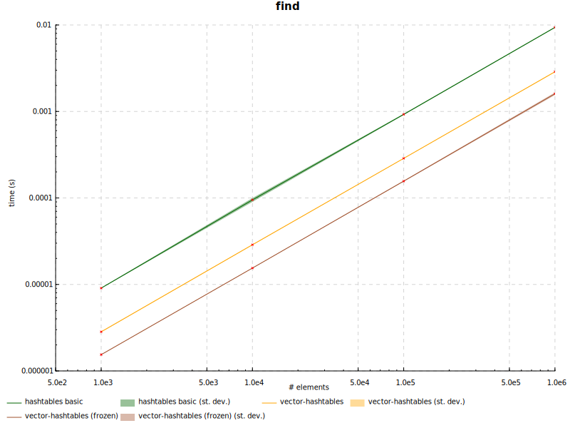
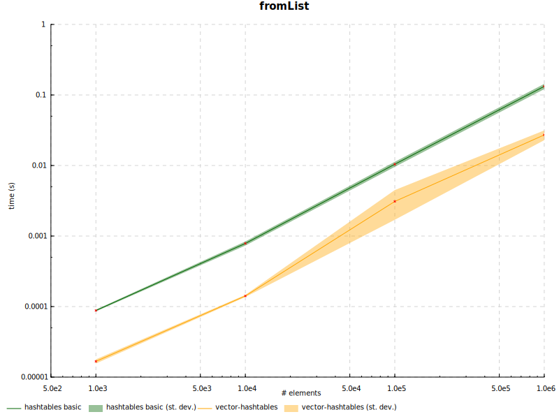
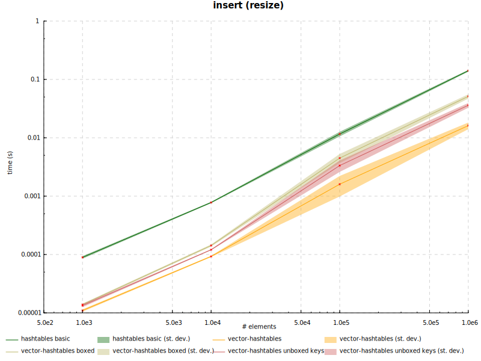
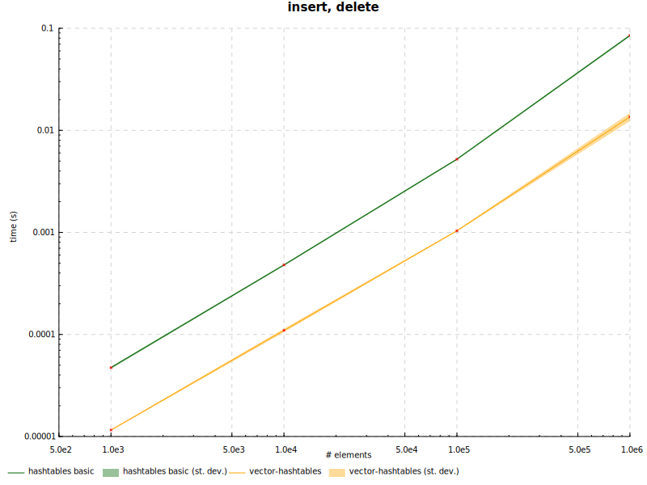
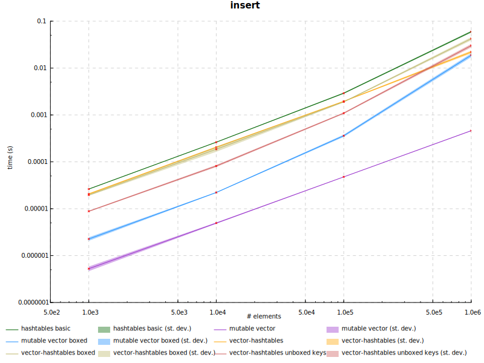
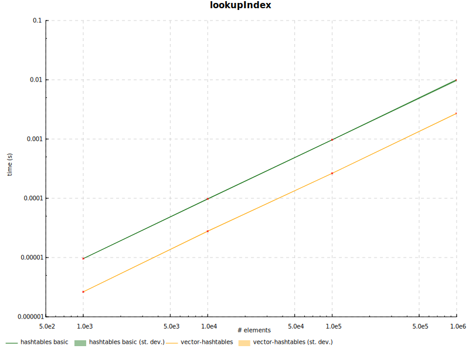
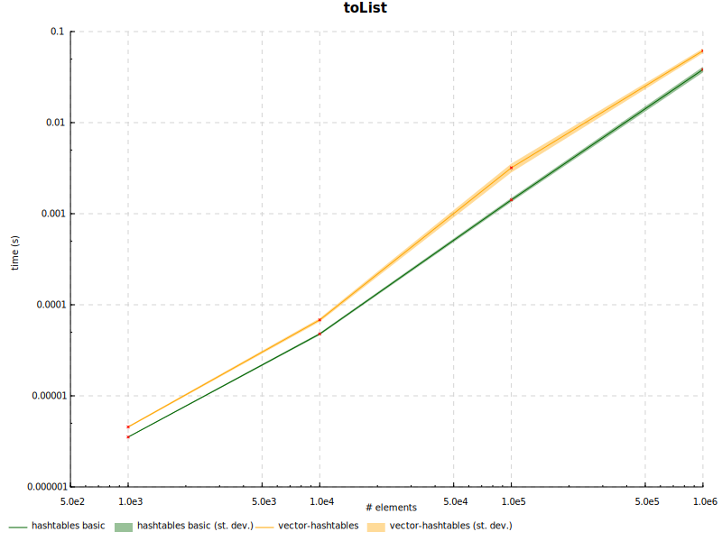

## Benchmarking charts

The charts below were produced by running `../scripts/Plots.hs` in the current directory.
The script requires `results.csv` in the same directory,
which can be produced by `cabal bench --benchmark-options="--csv results.csv"`.

